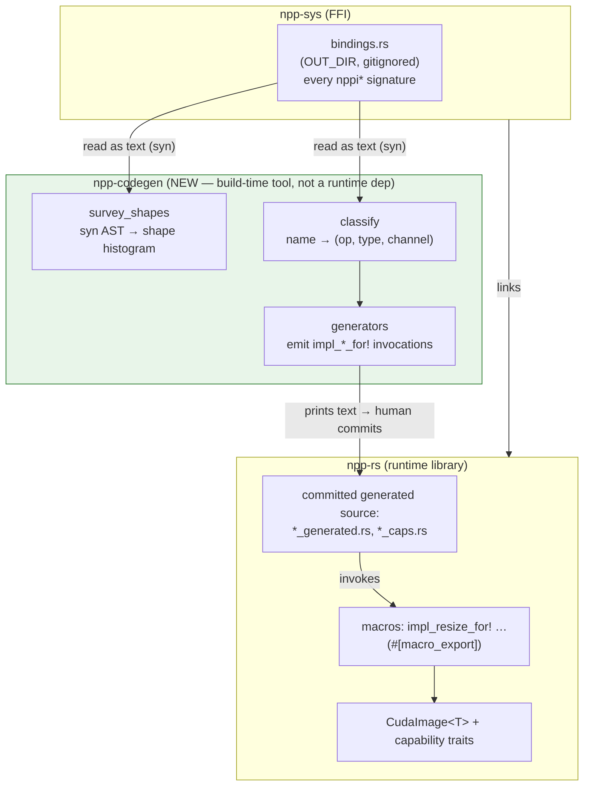
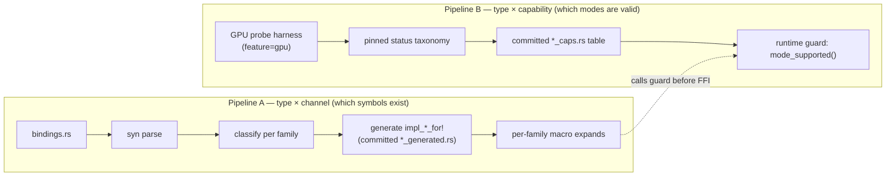
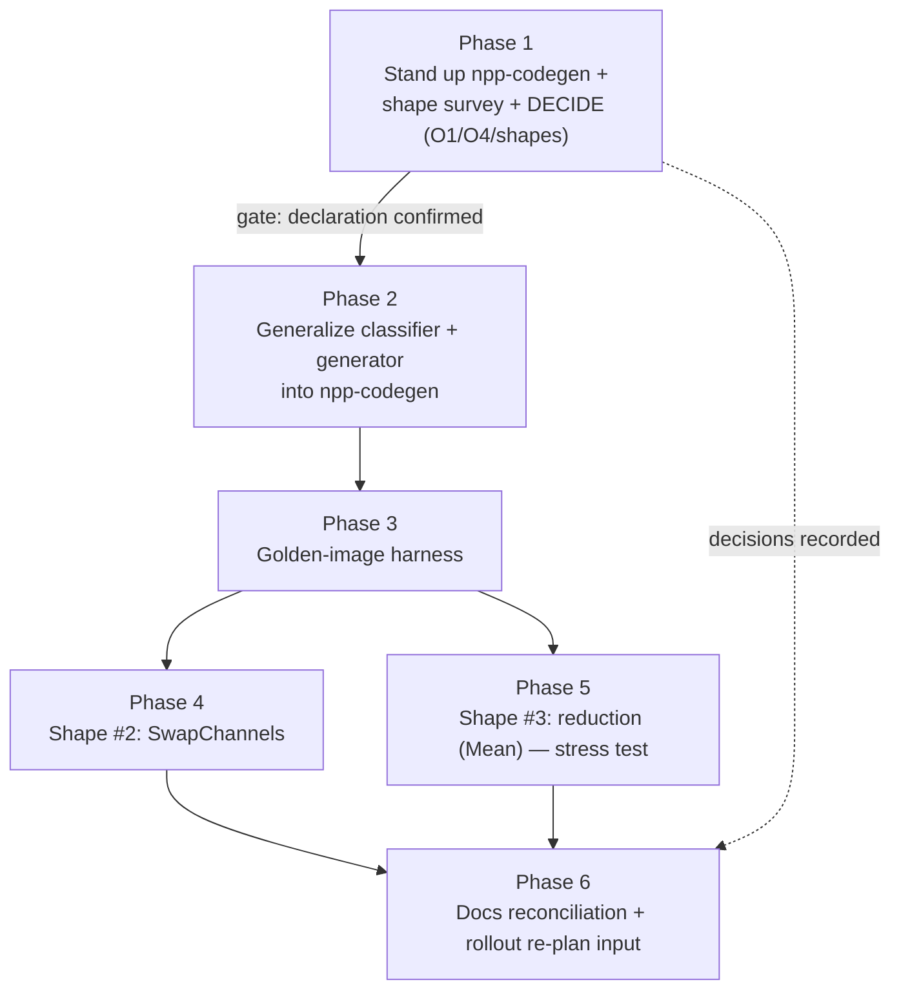
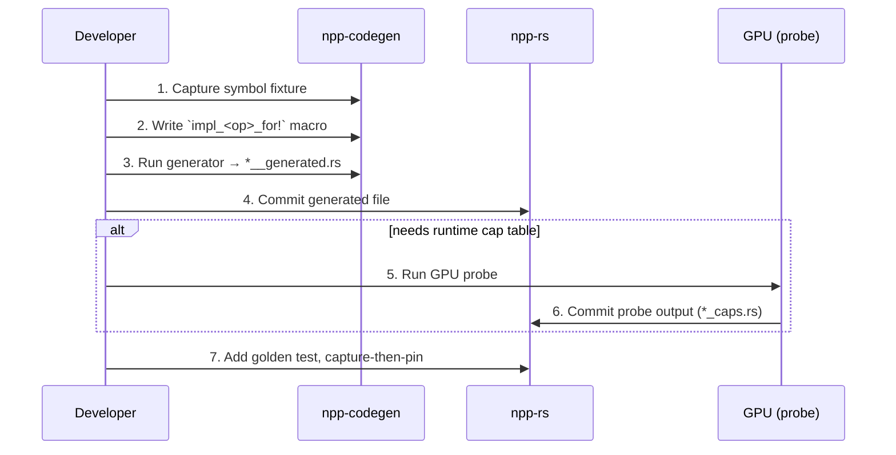

# Feature: F2 — First milestone ("Is the codegen machine general?")

Prove whether F1's declaration-macro pattern generalizes beyond Resize by:
(1) standing up a dedicated `npp-codegen` crate that measures the NPP shape
distribution and houses all build-time tooling, (2) generalizing the
Resize-only classifier/generator into that crate, (3) bringing up **two
deliberately-chosen shapes** (`SwapChannels`, then a reduction) each with a
byte-exact golden test. The milestone **ends** by producing the inputs for a
separate bulk-rollout plan. It does **not** wrap all of `nppi`.

**Definition of done:**
- `npp-codegen` crate exists, its `survey_shapes` binary has produced a shape
  histogram committed to `docs/npp-shape-survey.md`.
- The architecture decisions O1 (declaration vs. inference) and O4 (`_Ctx`
  posture) are locked; `docs/codegen-architecture.md` exists with mermaid
  diagrams documenting the three-crate boundary and two-pipeline model.
- Classifier and generator are generalized to ≥2 families; `impl_resize_for!`
  behaviours are unchanged (regression guard: `resize_generated.rs` output is
  byte-identical).
- `SwapChannels` and `Mean` are macro-generated with passing golden tests
  (or Mean's failure is a documented finding).
- `docs/roadmap.md` F2 section reflects measured reality.

---

## Architecture preamble: three crates, no cycles

Build-time tooling (survey, classifier, generators) lives in a **new
`npp-codegen` crate**. The runtime library `npp-rs` keeps only the macros and
the committed generated files; it does **not** depend on `npp-codegen`.



**Key invariant (diagram-enforced):** the arrow from `npp-codegen` to
`npp-rs` is **text, not a cargo dependency**. `npp-rs` builds with zero
knowledge of `npp-codegen`. This keeps the runtime library lean and the
public API free of build-tooling.

**API-change flag:** relocating `classify` deletes `pub mod suffix_classifier`
from `npp-rs`. That's a deliberate public-API narrowing — build tooling
shouldn't be in a library consumer's view. Called out so it's a conscious
decision, not a silent break.

## Two-pipeline codegen model

F1 already split capability into two derivation axes (roadmap F1 table).
`npp-codegen` formalizes this. Pipeline A is offline/deterministic (CPU,
every build). Pipeline B needs a GPU and is human-pinned (committed because
CI has no GPU lane).



## Milestone phase dependency



**Execution-mode legend:**
- 🧑‍🔬 — human-gated GPU (require device)
- 🐚 — human-gated Nix shell (no GPU)
- 🤖 — codegen-able / pure-Rust offline
- 🧭 — decision checkpoint
- 📝 — documentation deliverable

---

## Phase 1 — Stand up `npp-codegen`, run the shape survey, decide

Commit message: `feat(npp-codegen): add codegen crate with shape survey binary`

Every downstream choice collapses onto the (still-unmeasured) shape histogram.
This phase creates the crate that will own all codegen tooling and produces
the histogram as its first committed artifact.

### Step 1.1 — Create the `npp-codegen` crate

Create directory `npp-codegen/` with standard Cargo skeleton. Crate name
matches directory (`npp-codegen`), deliberately avoiding the
`npp/`-vs-`npp-rs` mismatch pattern.

**Files to create:**

`npp-codegen/Cargo.toml`:
```toml
[package]
name = "npp-codegen"
version = "0.1.0"
edition = "2021"

[dependencies]
syn = { version = "2", features = ["full", "extra-traits", "visit"] }
quote = "1"
proc-macro2 = "1"

# The tool reads bindings.rs as text; it does NOT depend on npp-sys or npp-rs.

[[bin]]
name = "survey_shapes"
path = "src/main.rs"
```

Root `Cargo.toml` workspace members list — edit from
```toml
members = ["npp-sys", "npp"]
```
to
```toml
members = ["npp-sys", "npp", "npp-codegen"]
```

**Crate-level doc** (`npp-codegen/src/lib.rs` — initially empty, will fill in
Phase 2):
```rust
//! # npp-codegen — build-time tooling for `npp-rs`
//!
//! Reads NPP's bindgen output (`bindings.rs`), classifies symbols and
//! signatures, and emits Rust source for the runtime library. This crate
//! does **not** depend on `npp-rs` — the boundary is text+commit, not cargo.
//!
//! ## Crate roles
//! - **survey_shapes** (`bin`): produces the shape histogram.
//! - **classify**: symbol-name parser extracting (op, type, channel).
//! - **generators**: emit `impl_*_for!` invocation lists.
//!
//! See `docs/codegen-architecture.md` for the full architecture with mermaid
//! diagrams.
```

The `#![deny(missing_docs)]` lint should be active.

**Verify:** `nix develop . --command cargo build` passes with the new workspace
member.

### Step 1.2 — Implement `survey_shapes` binary

**File:** `npp-codegen/src/main.rs`

Behaviour:
1. Locate `bindings.rs` — try `BINDINGS_RS` env var, then fall back to
   `find target -name bindings.rs -path "*/npp-sys/*"` (shelled out via
   `std::process::Command`, or accept it as first CLI arg). If not found,
   emit a clear error: "Run `cargo build -p npp-sys` first, or pass
   `BINDINGS_RS=/path/to/bindings.rs`."
2. Parse with `syn::parse_file()` (the generated file is valid, flat Rust).
3. Walk every `ForeignItemFn` where the ident starts with `nppi`.
4. Strip `_Ctx` from the name:
   - Function identity key = `full_name.strip_suffix("_Ctx").unwrap_or(full_name)`.
   - Remember whether this concrete declaration had `_Ctx` (report both
     totals: "base variants" and "of which have a Ctx twin").
5. Derive the parameter **shape** from the *types* (not names, though names
   are used as heuristics for roles). The role mapping:

   | C signature pattern | Role label |
   |---|---|
   | `*const T` + `int n...Step` (adjacent) | `SRC+STEP` |
   | `*mut T` + `int n...Step` (adjacent) | `DST+STEP` |
   | `NppiSize` | `SIZE` |
   | `NppiRect` | `RECT` |
   | `NppiPoint` | `POINT` (or `ANCHOR` if name contains `anchor`) |
   | pointer named `pSrc*` or `pSource*` | `SRC*` (rare standalone) |
   | pointer named `pDst*` | `DST*` (rare standalone) |
   | pointer named `pKernel` (+ `NppiSize` + `NppiPoint` if adjacent) | `KERNEL+KSIZE+ANCHOR` |
   | pointer named `pBuffer` / `nBufferSize` / `hpBufferSize` | `SCRATCH_BUF` |
   | `const int []` named `aDstOrder` / `aOrder` / `aConstants` | `CHANNEL_ORDER` / `CONST_ARRAY` |
   | `int` named `eInterpolation` | `INTERP` |
   | scalar named `nDivisor` / `nValue` / `nConstant` / `nScaleFactor` | `CONST_SCALAR` |
   | pointer to `Npp64f`/`Npp*` named `pMean`/`pMin`/`pMax`/`pSum`/`pStdDev` | `OUT_SCALAR` |
   | `NppStreamContext` | (dropped — marks this as a `_Ctx` twin) |
   | anything else | `MISC:<type>` |

   Adjacent params (`SRC*` then `STEP`) are merged into `SRC+STEP` (same for
   `DST`). `KERNELPTR` + `KSIZE` + `ANCHOR` are merged into
   `KERNEL+KSIZE+ANCHOR`. The final shape is the ordered, merged role list
   as a comma-separated string.

6. Derive the **family** (the `nppi` prefix up to the first `_\d`):
   `regex r"^(nppi[A-Za-z]+?)_\d"`.

7. Print the reports (to stdout):

   ```
   == TOTALS ==
   distinct functions (base, _Ctx collapsed) : <N>
     ...of which have a _Ctx twin            : <N_ctx>
   distinct families                         : <N_fam>
   distinct shapes                           : <N_shape>

   == COVERAGE CURVE ==
     top  5: <n5> / <N>  (<p5>%)
     top 10: <n10> / <N>  (<p10>%)
     top 15: <n15> / <N>  (<p15>%)
     top 20: <n20> / <N>  (<p20>%)
     top 30: <n30> / <N>  (<p30>%)

   == SINGLETON TAIL ==
     shapes used by exactly 1 function: <n1>
     shapes used by exactly 2 functions: <n2>
     shapes used by exactly 3 functions: <n3>

   == SHAPE HISTOGRAM ==
     <count> | <nfams> | <shape_string>
     ...

   == FAMILY→SHAPE TABLE (families using each shape) ==
     <shape>:
       - <family> (<n_functions>)
     ...

   == RESIZE SANITY CHECK ==
     nppiResize_8u_C1R -> <its_shape>
     OK[!] / MISMATCH[!]
   ```

   The Resize sanity gate is the *only* assertion the binary hardcodes:
   `nppiResize_8u_C1R` must map to shape `SRC+STEP, SIZE, RECT, DST+STEP,
   SIZE, RECT, INTERP`. If it doesn't, the binary prints `MISMATCH — abort`
   and exits with status 1.

**Acceptance** (`cargo run -p npp-codegen` after `cargo build -p npp-sys`):
prints the survey and says `OK` on the Resize line.

### Step 1.3 — Commit the histogram

Save the full output to `docs/npp-shape-survey.md`, preserving the timestamp
and CUDA version from `libnpp` in a header block.

**Add a reading guide paragraph at the top:**
```markdown
# npp-rs shape survey — NPP 12.4.1.87 (CUDA 12.9)

Produced by `cargo run -p npp-codegen` on <date>. The coverage curve
determines the codegen strategy (Phase 1.4). The shape histogram head lists
the exact macros to write. The singleton tail sizes the un-automated risk.
```

### Step 1.4 — Lock O1 (declaration vs. inference)

Decision rule, hard-committed:
- **top-15 shapes ≥ 80% of functions** → declaration templates confirmed.
- **top-15 shapes < 65%** → STOP. The declaration machine does not cover the
  head. Escalate to re-decide the architecture before proceeding.
- **65–80%** → declaration accepted, but the tail is flagged as a rollout
  risk in `docs/codegen-architecture.md`.

Record the decision in `.spar/brief.md` (updated in Phase 6, but decided
now).

### Step 1.5 — Lock O4 (`_Ctx` posture)

Default: **non-Ctx only** — every shape macro wraps only the non-`_Ctx`
variant. If the survey shows that >50% of functions have no non-Ctx form
(unlikely but possible for stateless ops), flip to **`_Ctx`-only** and
provide a default stream context under the hood.

Record the decision; it's frozen before any new macro is written.

### Step 1.6 — Confirm shapes #2 and #3

Default: **#2 = `SwapChannels`** (channel-reorder, one new signature shape:
`SRC+STEP, DST+STEP, SIZE, CHANNEL_ORDER`). **#3 = `Mean`** (reduction,
introduces the GetBufferHostSize + scratch + scalar-output pattern). If the
survey shows the `Mean` family is a tiny/irregular outlier, swap #3 for a
**filter** (`KERNEL+KSIZE+ANCHOR`).

**Verify (this phase):** `cargo build` passes; `survey_shapes` runs and says
`OK`; `docs/npp-shape-survey.md` committed; O1/O4/shape decisions recorded.

> **Gate — Phase 2 starts only if 1.4 confirms declaration templates.**

---

## Phase 2 — Generalize classifier + generator into `npp-codegen`

Commit message: `refactor(npp-codegen): generalize classify and generator,
remove suffix_classifier from npp-rs`

`npp/src/suffix_classifier.rs:23` hardcodes `"nppiResize_"`;
`npp/examples/gen_resize_impls.rs` reads one fixture. Both move into
`npp-codegen` and become family-parameterized. The `syn` parse from Phase
1.2 is reused.

### Step 2.1 — Relocate `classify` into `npp-codegen`

Copy `suffix_classifier.rs` from `npp/src/` to `npp-codegen/src/classify.rs`.
Make two changes:

- Parameterize the op-family prefix (e.g. `"nppiSwapChannels_"`) and the
  set of accepted variants (C1R/C3R/C4R/C4C3R etc.). Keep the original
  `classify` API as `fn classify(symbols: &[&str], prefix: &str) ->
  Vec<ClassifiedSymbol>`.
- Disable the `include_str!` fixture test (it references a path local to
  `npp`). Replace with a test that constructs inline data.

**Delete** `pub mod suffix_classifier` from `npp/src/lib.rs`. **Delete**
`npp/src/suffix_classifier.rs`. **Regression guard:** the `npp` crate still
builds without this module.

Update `lib.rs` in `npp-codegen` to declare `pub mod classify`.

Keep the 18 original offline Resize tests; add classifying them with the
parameterized API.

### Step 2.2 — Generalize the generator

Move `npp/examples/gen_resize_impls.rs` into `npp-codegen/src/gen_impls.rs`
(not a bin yet — will be wired as a CLI binary when multiple families need
generating). Make it accept a family descriptor + fixture path.

**Immediate regression guard:** calling the generalized generator with
`Resize`'s descriptor + fixture must produce output that is **byte-identical**
to the committed `npp/src/resize_generated.rs`.

### Step 2.3 — Unify input on `syn`

The generator now reads `bindings.rs` via `syn` (reusing the Phase 1 parse
path) rather than the name-only fixture. For each function, derive
`(type_token, channel)` from the ident AND cross-check that its actual
parameter types match the family's expected shape. A symbol whose params
don't match is rejected with a logged reason (the probe harness then handles
the diverging variant). This is strictly more robust than name-only.

### Step 2.4 — Offline tests for ≥2 families

Add `#[cfg(test)]` modules in `npp-codegen/src/classify.rs` testing:
- `Resize` accept/reject rules (all 18 original tests, transplanted).
- `SwapChannels` accept/reject rules (what variants exist, what's rejected).
- Fixture-validity pattern: parse each fixture file, assert every output
  has known types and channels.

**Verify:** `cargo test -p npp-codegen` passes; `cargo build -p npp-rs`
passes (confirming no residual dependency on the deleted `suffix_classifier`);
generator output is byte-identical to committed `resize_generated.rs`.

---

## Phase 3 — Minimal golden-image correctness harness

Commit message: `test(npp-rs): extract reusable golden-test helper`

Phase 3 lives in `npp-rs` (it tests the runtime lib, not the codegen tool).
The only oracle today is `npp/tests/golden_resize.rs` (one op). Lift its
capture-then-pin ritual into a reusable helper.

### Step 3.1 — Extract the golden test helper

Add a test-support module in `npp-rs` (e.g. `npp/src/test_helpers.rs`,
declared with `#[cfg(test)] pub mod test_helpers` or
`#[cfg(feature = "gpu")] pub mod test_helpers`). Extract the pattern from
`golden_resize.rs:65-72`:

```rust
/// Assert device output matches a golden reference, or panic with printable
/// bytes if the golden is not yet pinned.
///
/// # Manual pin procedure
///
/// 1. Run `cargo test --features gpu --test <your_test>`.
/// 2. It will print the captured output and panic ("golden reference not
///    yet pinned").
/// 3. Copy the printed byte literal into `EXPECTED` below.
/// 4. Re-run to confirm.
pub fn assert_golden<T: PartialEq + std::fmt::Debug>(
    actual: &[T],
    expected: &[T],
    label: &str,
) {
    if expected.is_empty() || expected.iter().all(|b| b == &Default::default()) {
        eprintln!("=== Golden reference NOT pinned for {label} ===");
        eprintln!("Captured output ({} bytes): {:?}", actual.len(), actual);
        panic!("golden reference not yet pinned for {label}");
    }
    assert_eq!(actual, expected, "pixel mismatch in {label}");
}
```

Document the contract: every macro-generated op family lands with ≥1 bit-exact
golden test, preferring integer/nearest paths to avoid FP variance.

### Step 3.2 — Wire the helper

Refactor `golden_resize.rs` to use the new helper (a thin diff: import +
replace inline assert). Confirm the behaviour is unchanged: `cargo test
--features gpu --test golden_resize` still passes.

**Verify:** `cargo build -p npp-rs`; `cargo test -p npp-rs`; `cargo test
--features gpu --test golden_resize` on a GPU box.

---

## Phase 4 — Shape #2: channel-reorder (`SwapChannels`)

Commit message: `feat(npp-rs): macro-generate SwapChannels for all types,
delete hand-written impl`

Structurally different from Resize (`CHANNEL_ORDER`, no rects/interp) yet
moderate difficulty. Lets the macro **subsume** the existing hand-written
`npp/src/swap_channel_ops.rs` — the cleanest proof of declaration generality.

### Step 4.1 — Capture the SwapChannels corpus

Run the Phase-2 generator with the `SwapChannels` family descriptor to
produce `npp/tests/fixtures/nppiSwapChannels_symbols.txt` (with dated header).
The fixture must exist before the generated file can be produced.

### Step 4.2 — Write `impl_swap_channels_for!`

New file `npp/src/swap_channels_macros.rs` (modelled on `resize_macros.rs`):

```rust
#[macro_export]
macro_rules! impl_swap_channels_for {
    ($rust_ty:ty, $token:expr, { $($ch:literal => $sym:path),+ $(,)? }) => {
        impl SwapChannels for CudaImage<$rust_ty> {
            fn bgra_to_rgb(&self, dst: &mut Self) -> Result<(), NppError> {
                // Dimension agreement check (survives --release)
                if self.width() != dst.width() || self.height() != dst.height() {
                    return Err(NppError::InvalidArgument(
                        "src and dst dimensions must match for bgra_to_rgb".into(),
                    ));
                }

                let nppi_size = NppiSize {
                    width: dst.width() as i32,
                    height: dst.height() as i32,
                };

                let src_base = cudarc::driver::DevicePtr::device_ptr(&self.buf);
                let src_ptr = (src_base + self.layout.img_index as u64) as *const $rust_ty;
                let dst_base = cudarc::driver::DevicePtrMut::device_ptr_mut(&mut dst.buf);
                let dst_ptr = (*dst_base + dst.layout.img_index as u64) as *mut $rust_ty;

                let order: [c_int; 3] = [2, 1, 0];  // BGRA → RGB: [B,G,R] → [R,G,B]
                let status = unsafe {
                    match self.channels() {
                        $(
                            $ch => $sym(
                                src_ptr as *const _,
                                self.layout.height_stride as i32,
                                dst_ptr as *mut _,
                                dst.layout.height_stride as i32,
                                nppi_size,
                                &order[0],
                            ),
                        )+
                        _ => {
                            return Err(NppError::InvalidArgument(format!(
                                "unsupported channel count {} for SwapChannels \
                                 with type {} — expected 4-channel source",
                                self.channels(), stringify!($rust_ty),
                            )));
                        }
                    }
                };
                check_status(status)
            }
        }
    };
}
```

Keep the non-overlap precondition doc, the byte-step doc (nStep is in bytes),
and the `img_index` sub-image offset logic.

### Step 4.3 — Generate and wire

Run the Phase-2 generator for `SwapChannels` → output as
`npp/src/swap_channels_generated.rs`. Add `pub mod swap_channels_generated`
and `pub mod swap_channels_macros` to `npp/src/lib.rs`.

**Delete** `npp/src/swap_channel_ops.rs` — the hand-written impl is
subsumed.

### Step 4.4 — Golden test

Create `npp/tests/golden_swap_channels.rs`, gpu-gated:

```rust
#![cfg(feature = "gpu")]

#[test]
fn test_golden_swap_channels_u8() {
    // Known BGRA input (reuse dimension/procedure from golden_resize.rs)
    // Verifies: 4-channel BGRA → 3-channel RGB via nearest integer
    // Capture-then-pin via the Phase-3 helper.
}
```

Use the same procedurally-generated test pattern as `golden_resize.rs`: known
gradient input (R on B channel, G on G channel, B on R channel), nearest
equivalent (integer-only), capture-then-pin on first GPU run.

**Verify:** offline triad; `cargo test --features gpu --test
golden_swap_channels` passes; `golden_resize` still green.

---

## Phase 5 — Shape #3: reduction (`Mean`) — the stress test

Commit message: `feat(npp-rs): add macro-generated Mean reduction

The shape most likely to **break** the declaration pattern — introduces the
`…GetBufferHostSize` two-call dance, a device scratch buffer, and a
host-scalar output. A documented negative result is a valid deliverable.

### Step 5.1 — Capture Mean corpus

Capture `nppiMean_*` and `nppiMeanGetBufferHostSize_*` symbols into
`npp/tests/fixtures/nppiMean_symbols.txt`. Note: the GetBufferHostSize
companion is a *separate* shape (`SIZE, OUT_SCALAR`) that pairs with the
reduction. Both need documentation.

### Step 5.2 — Design decision (recorded)

Attempt the macro. This is an **experimental step** whose output is recorded,
not measured against "does it compile." If the declaration macro cleanly
expresses the two-call + scratch + scalar-output pattern, proceed. If it
can't, write the finding: concretely, what about the pattern doesn't fit
the existing macro template (e.g. "traits can't return a host scalar from a
device buffer in one call") and what structural change to the codegen would
be needed.

**Record** the outcome in `docs/npp-shape-survey.md` as a post-script section.

### Step 5.3 — Introduce the reduction trait + result type

In `npp/src/imageops.rs`:

```rust
/// Capability trait for statistical reductions that return a host scalar.
pub trait Mean: Sized {
    /// Compute the mean of all pixel values and return it on the host.
    fn mean(&self) -> Result<f64, NppError>;
}
```

The macro expands to:
1. Call `nppiMeanGetBufferHostSize_<t>_C<n>R` → get scratch buffer size.
2. Allocate scratch buffer on device with `device.alloc_zeros::<u8>(size)?`.
3. Call `nppiMean_<t>_C<n>R(src, step, size, pBuffer, pMean)`.
4. Read back `pMean` (a GPU-allocated `Npp64f`) via `device.dtoh_sync_copy`.

### Step 5.4 — Capability probe (only if needed)

If `Mean` has a type/variant validity axis (some types unsupported), add a
probe mirroring `probe_resize_caps.rs` + the pinned taxonomy from
`spike_npp_status.rs`. **If it requires only u8/32f (common NPP pattern),
skip the probe** — the pair is statically known.

**Flag:** the existing `probe_resize_caps.rs` is copy-pasted per type
(`:76-241`). Note this as rollout debt; do not fix here.

### Step 5.5 — Golden test

`npp/tests/golden_mean.rs` (gpu-gated): a known small image (e.g. 3×3
constant-fill) whose mean is exactly computable by hand → assert the
returned scalar. Capture-then-pin via the Phase-3 helper.

**Verify:** offline triad; `cargo test --features gpu --test golden_mean`
passes on GPU; the 5.2 outcome (macro or finding) is recorded.

---

## Phase 6 — Documentation reconciliation & rollout re-plan input

Commit message: `docs: add codegen-architecture.md with mermaid diagrams,
update roadmap with measured F2 findings`

The milestone's real output is a measured answer + an estimate + a documented
architecture, so the bulk rollout can be planned with data.

### Step 6.1 — Author `docs/codegen-architecture.md`

This is the authoritative description of `npp-codegen`:

- The three-crate boundary (`npp-sys` → `npp-codegen` → text → `npp-rs`),
  with the **embedded mermaid** crate-architecture diagram (from the preamble
  above).
- The two-pipeline model (Pipeline A: type×channel codegen; Pipeline B:
  type×capability probe), with the **embedded mermaid** pipeline diagram.
- The per-family "add a new shape" sequence (the steps a developer follows
  to add a new op family), with an **additional mermaid sequence diagram**:



- The role-mapping reference table (reproduced from Phase 1.2).
- The regenerate-on-CUDA-bump runbook.
- The explicit **no-dependency invariant** (the rule that `npp-rs` never
  depends on `npp-codegen`).

Cross-link from `docs/architecture.md` (add a "Codegen" section there).

### Step 6.2 — Update `.spar/brief.md`

Record:
- The histogram results (top-N coverage, singleton tail count).
- Locked O1 decision (declaration confirmed, or escalation).
- Locked O4 decision (non-Ctx only).
- Confirmed shapes #2 and #3.
- Per-shape cost: roughly how many person-hours / lines each took.
- Phase 5 outcome.

### Step 6.3 — Update `docs/roadmap.md` F2 section

Replace the dead "mechanical table-entry work" framing (`roadmap.md:93-94`)
with: "F2 = N declaration macros over the histogram head; the tail is
[hand-written / deferred / inference engine needed]." Include:

- The measured head shape count and coverage percentage.
- The bounded estimate: `head_shape_count × measured_per_shape_cost`.
- The tail strategy (hand-write, defer, or build an inference parser).
- A link to `docs/codegen-architecture.md` for the full machinery.

### Step 6.4 — Produce the rollout go/no-go input

A one-paragraph recommendation at the top of `.spar/brief.md` :

> Given a measured head of N shapes covering P% of functions and a per-shape
> cost of C hours, the full `nppi` bulk rollout is estimated at N×C hours
> ±[variance] for the head, plus the tail at [estimated cost]. The
> strategy is [declaration templates / inference / hybrid]. This is the seed
> for the next plan.

**Verify:** `cargo doc --no-deps -p npp-rs -p npp-sys -p npp-codegen` builds;
`cargo fmt --check`; all `docs/*.md` render (mermaid valid); the roadmap F2
section reads correctly.

---

## Documentation standard (applies to every phase)

- **Every new crate**: crate-level `//!` doc with an architecture overview +
  at least one mermaid diagram (diagrams live in `docs/*.md` for GitHub
  rendering; rustdoc's native support may be added later).
- **Every new `pub` item**: doc comment. `#![deny(missing_docs)]` already
  enforces this in `npp-rs` (`lib.rs:27`); apply the same lint to
  `npp-codegen`.
- **Every CUDA-context-lifetime-relevant item**: restate the C7 invariant
  (the device handle must outlive all buffers created from it).
- **Mermaid** is used where it clarifies structure or flow — crate
  boundaries, the two pipelines, the add-a-shape sequence — not for
  decoration.

## Cross-cutting risks

| ID | Risk | Mitigation |
|----|------|------------|
| R1 | Phase-1 gate is load-bearing — inference escalation invalidates Phases 2–5 | Gate is *explicit* and *early*; escalation stops work before sunk cost. |
| R2 | Phase 5 results in a negative outcome (macro doesn't fit the reduction shape) | Treated as a deliverable, not a blocker. Recorded finding. |
| R3 | F8 (streams) collides with `_Ctx` posture decision — every macro template regenerated when streams land | Mitigated by freezing O4 in Phase 1.5 before any new macro is written. |
| R4 | Probe non-generality: `probe_resize_caps.rs` is copy-pasted per type (`:76-241`) | Acknowledged debt, deliberately out of scope for this milestone. Flagged in `docs/codegen-architecture.md`. |
| R5 | Dependency creep: `npp-rs` depends on `npp-codegen` | The architecture doc *states the invariant explicitly*; any PR that adds the dependency is review-flagged. |
| R6 | The `syn`-based parse in `npp-codegen` is tightly coupled to the *current* bindgen output format | If bindgen changes its file layout, the parser breaks. Mitigated by: the survey is a diagnostic tool, not a critical build step; failures are visible immediately. |
